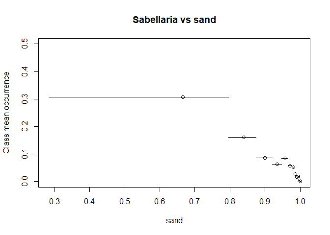
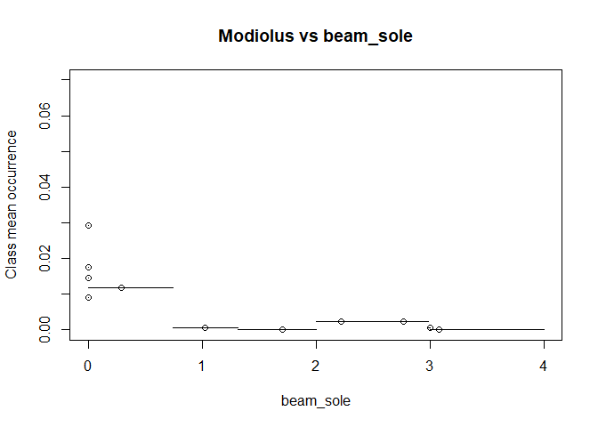
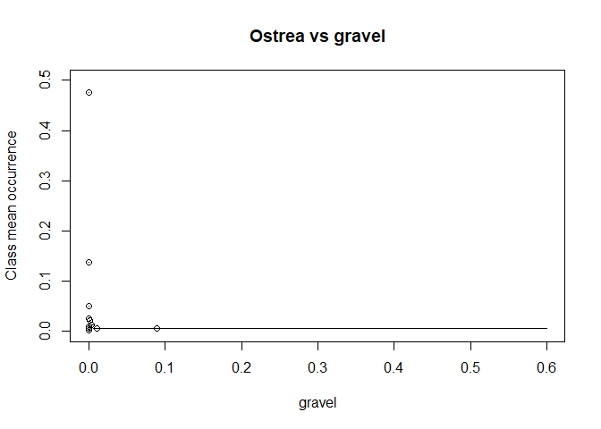

Mapping Reef forming North Sea Species
================
Peter M.J. Herman and Floris van Rees
11/2/2021

# Introduction

The purpose of the analysis described in this document is to collect and
interpret data on the spatial distribution of reef-forming species that
can potentially occur in Dutch North Sea waters. This is part of the
MONS research programme. It is executed by Deltares on demand of
Rijkswaterstaat.

The species of interest for this analysis are *Sabellaria spinulosa*,
*Modiolus modiolus*, *Lanice conchilega* and *Ostrea edulis*. All four
of these species can form biogenic reefs, which in turn can form
hotspots for biodiversity as they provide attachment or hiding
opportunities for other species. Biogenic reefs are recognized as
habitats worthy of special protection in OSPAR and EU regulations. That
applies in particular to *Sabellaria spinulosa* and *Modiolus modiolus*,
where trawling is considered to endanger the special habitats created by
the reefs. *Lanice conchilega* is a very common species that does not
appear to be particularly threatened, whereas *Ostrea edulis* is
practically extinct in the North Sea, but is currently the subject of
intense restoration efforts.

The aim of the current analysis is to predict as accurately as possible
where the species of interest can develop stable populations, given the
environmental gradients and the gradients in human use of the North Sea.
For the three species that are currently occurring in the North Sea, the
habitat preference is deduced from their current occurrence patterns and
the spatial distribution of relevant environmental characteristics.
Fisheries intensity was used as a co-factor in these analysis, in an
attempt to delineate how fisheries pressure by different gear affects
the current occurrence patterns. For *Ostrea edulis*, this approach was
not possible as the species is currently not recorded in the North Sea,
with the exception of some recent population developments at the very
margin of the North Sea in Voordelta, Rotterdam harbour and Wadden Sea,
and occurrences on buoys and other artificial structures. The spatial
coordinates of the latter sparse observations cannot be used as an
indicator of habitat suitability for stable oyster populations, as they
are dependent on artificial substrates. Physiologically, flat oysters
can probably survive in most of the North Sea provided a larval source
and hard substrate are available. This is, however, not indicative of
the range of habitats where the species might reestablish a stable,
self-sustaining population. In order to deduce the spatial delineation
of potentially suitable areas for restoration of flat oysters, data on
historical abundance in Dutch and Belgian waters have been used, based
on Bennema et al. (2020) and Houziaux et al. (2008). It is possible that
some historic occurrences along the British coasts have been missed by
this selection, but for the Dutch EEZ and its immediate surroundings,
this selection may suffice.

Available occurrence data for the three other species have recently been
compiled in the framework of EMODnet Biology (Herman et al., 2020). By
carefully selecting the data sets that have, in principle, looked for
the entire macrobenthic community (or for a well-defined part thereof,
e.g. all shellfish), the presence-only database has been transformed
into a presence/absence dataset. It has been assumed that wherever a
sample targeting the entire macrobenthic community has taken, all
macrobenthic species not recorded in the sample were actually absent in
the sample. Therefore, all these species have been attributed an
‘absence’ record in all community samples where they have not been
found. In total, more than 60 data sets covering almost 100,000 samples
have been collected in the Greater North Sea, which also includes the
Irish sea and part of the N.E. Atlantic. the number of samples in the
North Sea proper is around 20,000. In addition to this dataset, WMR has
made available the data from all the fish surveys they have performed in
the North Sea. In the fish surveys, bycatch of benthic animals is
recorded. Especially for *Sabellaria spinulosa* and *Modiolus modiolus*
this results in regular reporting of presence of the species. The number
of positive recordings for *Lanice conchilega* was so low that we
estimated the catchability of this species by the fishing gear is not
sufficient to use the data base for their distribution. *Ostrea edulis*
was not reported in this data set. For the two species of interest, all
samples where the species was not recorded, was noted as ‘absence’ of
the species. These data were then added to the EMODnet data base.

Here we make use of the presence/absence data in the North Sea proper,
thus neglecting data in the Channel and Irish Sea. The reason for the
selection is that for the North Sea proper we can make use of
environmental data collected and made available by van der Reijden et
al. (2018). By regressing the presence/absence data on the environmental
data set, we can gain some insight in the environmental parameters
steering the spatial distribution of the species, but we can also refine
and improve the spatial interpolation between observations. In this
analysis, we applied two regression techniques: logistic regression and
random forest regression. Results of both approaches are given. These
results compare favourably, thus providing credibility to the estimated
patterns of occurrence.

The present document is set up as an R Markdown document. The Latex code
of the document is generated while the enclosed R code is executed, thus
guaranteeing simultaneous and consistent execution of the code
documented in the text. In the document we show the scripts for the
different steps in the analysis. These scripts and the underlying files
have been deposited in a stable repository with URL <to be filled in>.

# Structure of the project

The R script in this document analyses the underlying data sets and
produces a number of ESRI shapefiles (for vector data) and geotiff
raster files (for raster data) out of these data sets. All these GIS
files have been compiled into a QGIS project that can be found back in
the underlying directory structure of the project. In addition, all
layers have been exported from the GIS project into a geo-pdf file,
which allows to show all layers independently or in combinations within
Acrobat Reader, and which should also allow to retrieve all layers in a
GIS, without recourse to the original shape and raster files.

The directory structure of the project is shown in Table I.

| Directory | Content |
|:---|:---|
| project root directory |  |
| \|-base_data | data to be read in by the scripts and used in the products |
| ..\|-EMODnet_data | data from the EMODnet data base. These include the Dutch MWTL data |
| ..\|-data_WMR | data provided by WMR. Only data from the fish surveys (Datras) have been used |
| ..\|-Ostrea | data from Bennema et al. (2020) and Houziaux et al. (2008) |
| \|-Environment | data on environmental factors |
| ..\|-DCSM-FM | output of the Deltares North Sea model, used for bottom shear stress |
| ..\|-Environmental_factors | raster files provided by van der Reijden et al.(2018) |
| ..\|-Fisheries_data | data on fisheries intensity by van der Reijden et al.(2018) |
| ..\|-rasters | resampled rasters of environmental factors, used in analysis |
| \|-Europe_coastline_shapefile | downloaded from EEA, used to blank the rasters over land |
| \|-output | rasters with the predicted values for all species from the two models |
| \|-QGIS | QGIS project file |
| \|-Shapefiles_species | Shapefiles with the presence/absence data per species, except for the DATRAS data |
| ..\|-WMR | Shapefiles with the DATRAS data for the species |

Table I. Directory structure of the project

# Preliminary settings

We require a number of R packages to execute the analyses. We further
set some constants such as directory names and projection strings. All
analysis of spatial data will use UTM zone31 coordinates.

``` r
# required packages
require(raster)
```

    ## Loading required package: raster

    ## Warning: package 'raster' was built under R version 4.4.2

    ## Loading required package: sp

``` r
require(rgdal)
```

    ## Loading required package: rgdal

    ## Warning in library(package, lib.loc = lib.loc, character.only = TRUE,
    ## logical.return = TRUE, : there is no package called 'rgdal'

``` r
require(tidyverse)
```

    ## Loading required package: tidyverse

    ## ── Attaching core tidyverse packages ──────────────────────── tidyverse 2.0.0 ──
    ## ✔ dplyr     1.1.4     ✔ readr     2.1.5
    ## ✔ forcats   1.0.0     ✔ stringr   1.5.1
    ## ✔ ggplot2   3.5.1     ✔ tibble    3.2.1
    ## ✔ lubridate 1.9.3     ✔ tidyr     1.3.1
    ## ✔ purrr     1.0.2     
    ## ── Conflicts ────────────────────────────────────────── tidyverse_conflicts() ──
    ## ✖ tidyr::extract() masks raster::extract()
    ## ✖ dplyr::filter()  masks stats::filter()
    ## ✖ dplyr::lag()     masks stats::lag()
    ## ✖ dplyr::select()  masks raster::select()
    ## ℹ Use the conflicted package (<http://conflicted.r-lib.org/>) to force all conflicts to become errors

``` r
require(tidync)
```

    ## Loading required package: tidync

    ## Warning in library(package, lib.loc = lib.loc, character.only = TRUE,
    ## logical.return = TRUE, : there is no package called 'tidync'

``` r
require(FNN)
```

    ## Loading required package: FNN

    ## Warning in library(package, lib.loc = lib.loc, character.only = TRUE,
    ## logical.return = TRUE, : there is no package called 'FNN'

``` r
require(randomForest)
```

    ## Loading required package: randomForest

    ## Warning: package 'randomForest' was built under R version 4.4.2

    ## randomForest 4.7-1.2
    ## Type rfNews() to see new features/changes/bug fixes.
    ## 
    ## Attaching package: 'randomForest'
    ## 
    ## The following object is masked from 'package:dplyr':
    ## 
    ##     combine
    ## 
    ## The following object is masked from 'package:ggplot2':
    ## 
    ##     margin

``` r
# working directories
dcsm_dir <- paste0("p:/1204257-dcsmzuno/2013-2017/3D-DCSM-FM/A25_ntsu1/",
                   "DFM_OUTPUT_DCSM-FM_0_5nm")
emodnet_data_dir <- "../data/raw_data/EMODnet_data"
DATRAS_data_dir <- paste0("../data/raw_data/data_WMR/",
                          "2021-11-03-MONS-data-naar-Deltares/",
                          "DATRAS-Fish-surveys")
oyster_data_dir <- "../data/raw_data/Ostrea"
coast_shape_dir <- "../data/raw_data/Europe_coastline_shapefile"
stress_dir <- "../data/Environment/DCSM-FM/"
spec_data_dir <- "../data/raw_data/Shapefiles_species"
WMR_spec_data_dir <- "../data/raw_data/Shapefiles_species/WMR"
output_dir <- "../product"
# projection strings for spatial data
proWG<-CRS("+proj=longlat +datum=WGS84")
# proUTM <- CRS("+proj=utm +zone=31 +ellps=GRS80 +units=m +no_defs")
proUTM <- CRS("+init=epsg:25831")
```

    ## Warning in CPL_crs_from_input(x): GDAL Message 1: +init=epsg:XXXX syntax is
    ## deprecated. It might return a CRS with a non-EPSG compliant axis order.

# Prepare all environmental information

Environmental information is needed as a basis for species distribution
models. For this project, we rely heavily on a recent compilation of
North Sea wide environmental information by van der Reijden et
al. (2018). These authors have compiled their datasets on bathymetry,
grain size distribution, temperature and salinity from diverse
literature sources. They have made their data available in the form of
geo-tiff files, that we have downloaded for use in the present project.
In the files, there is also information on bottom shear stress, but this
is based on a rather coarse model. We have replaced it with results of
the Deltares DCSM-FM model for the greater North Sea. The datasets used
are listed in Table II. Sources of the data are van der Reijden et
al. (2018) for fisheries and calculations of ‘Bathymetric Position
Index’ values based on bathymetry, Stephens (2015) for grain size data,
Copernicus marine services (www.marine.copernicus.eu) for salinity and
temperature, EMODnet bathymetry (<http://portal.emodnet-bathymetry.eu/>)
for basic bathymetry, Deltares for bottom shear stress calculated with
DCSM-FM.

The ‘BPI’ (Bathymetric position index) calculates for each point, the
difference of the depth of the point with the averag depth of the
surrounding area, where the surrounding area is a circle with a fixed
radius. BPI5 uses 5 km as a radius for the surroundings, and similar for
the other BPI variables. van der Reijden et al. (2018) also define a
weighted average BPI, but we did not use that in our analysis.

Temperature difference is a measure for the change in temperature
between 2008 and 2013. This is not distributed homogeneously over the
North Sea. Atlantic water has warmed very little, whereas the North Sea
has been warming considerably over the past decades. Consequently, the
largest temperature differences are seen in the eastern and
north-eastern parts of the North Sea.

No temporal (e.g. seasonal) variance of salinity and temperature has
been used in the present study. It is known that variation of these
variables is often very important in estuarine conditions. However, in
the North Sea the ranges are much more limited. It is unlikely that any
of these parameters would fall outside of the tolerance of the species,
with the probable exception of temperature for the boreal species
*Modiolus modiolus*. However, also mean temperature appeared to be a
very useful variable in predicting the range of this species, and
obviously there is a tight correlation between mean temperature and
yearly temperature range in the North Sea.

| Env.Variable    | Explanation                                | Source        |
|:----------------|:-------------------------------------------|:--------------|
| Depth           | Depth at 178 m resolution                  | EMODnet       |
| BPI5            | Bathymetric Position Index 5 km            | vdReijden2018 |
| BPI10           | Bathymetric Position Index 10 km           | vdReijden2018 |
| BPI75           | Bathymetric Position Index 75 km           | vdReijden2018 |
| Bott.shr.stress | Bottom shear stress from currents          | DCSM-FM       |
| Salinity        | Mean Salinity                              | Copernicus    |
| Temperature     | Mean Temperature                           | Copernicus    |
| Temp.diff       | Temperature Difference over the year       | Copernicus    |
| Gravel          | Fraction gravel in sediment                | Stephens2015  |
| Mud             | Fraction Mud in sediment                   | Stephens2015  |
| Sand            | Fraction Sand in sediment                  | Stephens2015  |
| Beam_plaice     | Intensity beam trawling for plaice         | vdReijden2018 |
| Beam_sole       | Intensity beam trawling for sole           | vdReijden2018 |
| Otter_mix       | Intensity otter trawling for mixed species | vdReijden2018 |

Environmental data and their source

The following code blocks are used, first to extract and reconfigure the
model results on bottom shear stress from currents, subsequently to read
all environmental factors, and to resample them to the same resolution
for all variables.These intermediate rasters are stored for later use,
as it is a quite time-consuming process.

The enviromental rasters are used for two purposes. First, for every
sample the environmental information can be read from the rasters. This
will complete the data frame with sample information. This step is
performed later in the code, as the data frame with species occurrence
has first to be prepared. Secondly, the rasters are used as a basis for
the predictions based on the regression models. A data frame ‘newdats’
is made, that contains for every point on the raster, the coordinates of
the point and the values of all environmental variables in the point.
Using these data and the regression model, a model prediction can be
made for every point on the raster. These predictions are then again
assembled in a raster and presented in GIS.

``` r
if(! file.exists("../data/Environment/DCSM-FM/DCSM_mean_stress.tif")){
  # read model output files and store mesh + bss in one data frame
  for(filn in 0:19){
    filname<-paste0(dcsm_dir,"/DCSM-FM_0_5nm_00",
                    formatC(filn, width = 2, format = "d", flag = "0"),"_fou.nc")
    tt <- tidync(filname) %>% 
      activate("D3") %>%
      hyper_tibble() %>% 
      select(mesh2d_face_x,
             mesh2d_face_y,
             mesh2d_flowelem_ba,
             mesh2d_flowelem_bl,
             mesh2d_flowelem_domain,
             mesh2d_flowelem_globalnr,
             mesh2d_fourier010_mean,
             mesh2d_fourier011_max)
    if(filn==0)tt2 <- tt else tt2 <- rbind(tt2,tt)
  }
  # reproject data in UTM
  tt3<-tt2[,1:3]
  coordinates(tt3) <- ~ mesh2d_face_x + mesh2d_face_y
  projection(tt3) <- proWG
  tt3<- spTransform(tt3,proUTM)
  xymat <- as.matrix(coordinates(tt3))
  tt2 <- tt2 %>%
    mutate (x_utm=xymat[,1])%>%
    mutate (y_utm=xymat[,2])
  # define a regular raster to store the values with a 1 km resolution
  r_mean_stress <- r_max_stress <- raster(ext=extent(-200000,900000,5300000,6600000),
                                          crs=proUTM,resolution=1000)
  cor<-as.matrix(coordinates(r_mean_stress))
  # for each raster cell, determine the nearest neighbour in model output and 
  # store this value in rasters
  nn<-get.knnx(data=xymat,query=cor,k=1)
  values(r_mean_stress)<-tt2$mesh2d_fourier010_mean[nn$nn.index]
  values(r_max_stress)<-tt2$mesh2d_fourier011_max[nn$nn.index]
  # use shapefile of European coastlines to blank out land
  if(!file.exists(file.path(coast_shape_dir,"ecst.Rdata"))){
    ecst<-readOGR("../data/raw_data/Europe_coastline_shapefile","Europe_coastline_poly")
    ecst<-spTransform(ecst,proUTM)
    ecst<-crop(ecst,extent(-500000,1000000,5000000,7000000))
    save(ecst,file=file.path(coast_shape_dir,"ecst.Rdata"))
  } else {
    load(file.path(coast_shape_dir,"ecst.Rdata"))
  }
  r_mean_stress <- mask(r_mean_stress,ecst,inverse=TRUE)
  r_max_stress  <- mask(r_max_stress ,ecst,inverse=TRUE)
  raster::writeRaster(r_mean_stress,"../data/Environment/DCSM-FM/DCSM_mean_stress.tif",
                      overwrite=TRUE)
  raster::writeRaster(r_max_stress,"../data/Environment/DCSM-FM/DCSM_max_stress.tif",
                      overwrite=TRUE)
}
```

``` r
# list of environmental factors
envies <- data.frame(name = c(
  "mean_stress",
  "depth",
  "bpi5",
  "bpi10",
  "bpi75",
  "wt_BPI",
  "meantemp",
  "difftemp",
  "salinity",
  "sand",
  "gravel",
  "mud",
  "beam_plaice",
  "beam_sole",
  "otter_mix"),
                     file = c(
  "../data/Environment/DCSM-FM/DCSM_mean_stress.tif",
  "../data/Environment/Environmental_factors/depth.tif",
  "../data/Environment/Environmental_factors/bpi5.tif",
  "../data/Environment/Environmental_factors/bpi10.tif",
  "../data/Environment/Environmental_factors/bpi75.tif",
  "../data/Environment/Environmental_factors/summed_weighted_BPI_SA.tif",
  "../data/Environment/Environmental_factors/meantemp.tif",
  "../data/Environment/Environmental_factors/difftemp.tif",
  "../data/Environment/Environmental_factors/salinity.tif",
  "../data/Environment/Environmental_factors/sand.tif",
  "../data/Environment/Environmental_factors/gravel.tif",
  "../data/Environment/Environmental_factors/mud.tif",
  "../data/Environment/Fisheries_data/Average_FI_Beam-Plaice.tif",
  "../data/Environment/Fisheries_data/Average_FI_Beam-Sole.tif",
  "../data/Environment/Fisheries_data/Average_FI_Otter-Mix.tif"),
  lowlim=c(
    0.1,  # mean_stress
    -50,  # depth
    -20,  # bpi5
    -15,  # bpi10
    -30,  # bpi75
    6,    # wt_BPI
    9.5,  # meantemp
    9,    # difftemp
    26,   # salinity
    0.6,  # sand
    0.02, # gravel
    0.02, # mud
    0.1,  # beam_plaice
    0.1,  # beam_sole
    0.1   # otter_mix
    ),
  uplim=c(
    3,    # mean_stress
    0,    # depth
    20,   # bpi5
    15,   # bpi10
    30,   # bpi75
    18,   # wt_BPI
    13,   # meantemp
    16,   # difftemp
    34,   # salinity
    0.99, # sand
    0.6,  # gravel
    0.3,  # mud
    2.1,  # beam_plaice
    2.1,  # beam_sole
    2.1   # otter_mix
  )
)
# store rasters with env info if not yet done
rbas <- raster(envies$file[9])
for (i in 1:nrow(envies)){
  rfn<-paste0("../data/Environment/rasters/",envies$name[i],".grd")
  if(! file.exists(rfn)){
    r <- raster(envies$file[i])
    r2 <- resample(r,rbas)
    names(r2) <- envies$name[i]
    writeRaster(r2,file=rfn)
  }else{
    r2<-raster(rfn)
  }
  if(i==1)b<-brick(r2) else b <- addLayer(b,r2)
}
# prepare the data frame newdats, containing all environmental information for 
# each node of the raster and used to make predictions 
if(! file.exists("../data/Environment/newdats.Rdata")){
  newdats<-data.frame(mean_stress=values(raster::subset(b,"mean_stress")),
                      depth=values(raster::subset(b,"depth")),
                      bpi5=values(raster::subset(b,"bpi5")),
                      bpi10 = values(raster::subset(b,"bpi10")),
                      bpi75 = values(raster::subset(b,"bpi75")),
                      meantemp=values(raster::subset(b,"meantemp")),
                      difftemp=values(raster::subset(b,"difftemp")),
                      salinity=values(raster::subset(b,"salinity")),
                      sand = values(raster::subset(b,"sand")),
                      gravel=values(raster::subset(b,"gravel")),
                      mud=values(raster::subset(b,"mud")),
                      lon=coordinates(b)[,1],
                      lat=coordinates(b)[,2])
  newdats <- newdats %>%
    filter(!is.na(mean_stress))%>%
    filter(!is.na(depth)) %>%
    filter(!is.na(mud))
  save(newdats,file="../data/Environment/newdats.Rdata")
} else {
  load("../data/Environment/newdats.Rdata")
}
```

# Extracting species presence/absence information from the available data sets

## EMODnet Biology Product

The EMODnet Biology product on pesence/absence of species in samples in
the Greater North Sea is delivered as a binary R file. Alternatively, it
is also available as a .csv file, but this takes longer to read in.

In the following code chunk a function is defined that retrieves the
data for a particular species and writes the results as a shape file for
use in GIS. Species are identified using their AphiaID, which is their
unique identification in WoRMS, the World Register of Marine Species
(<https://marinespecies.org>)

``` r
# load binary data with species presencs/absence data
load(file.path(emodnet_data_dir,"spe.Rdata"))
# function to extract a particular species from the data file and write as shapefile
extr_spec<-function(AphiaID,filnam){
  col<-which(names(spe)==paste0("pa",AphiaID))
  sabs<- cbind(spe[,1:4],spe[,col])
  names(sabs)<-c("eventNummer","eventDate","lon","lat","presabs")
  sabs<-sabs[!is.na(sabs$presabs),]
  sabs$presabs<-ifelse(sabs$presabs,1,0)
  coordinates(sabs)<- ~lon+lat
  projection(sabs)<-proWG
  # writeOGR(sabs, file.path(spec_data_dir,filnam), filnam, 
  #          driver="ESRI Shapefile",overwrite_layer = TRUE)
  sf::st_write(sf::st_as_sf(sabs), file.path(spec_data_dir,paste0(filnam, ".shp")), append = F)
}

extr_spec(130867,"Sabellaria")
```

    ## Warning in abbreviate_shapefile_names(obj): Field names abbreviated for ESRI
    ## Shapefile driver

    ## Deleting layer `Sabellaria' using driver `ESRI Shapefile'
    ## Writing layer `Sabellaria' to data source 
    ##   `../data/raw_data/Shapefiles_species/Sabellaria.shp' using driver `ESRI Shapefile'

    ## Warning in CPL_write_ogr(obj, dsn, layer, driver,
    ## as.character(dataset_options), : GDAL Message 6: Field eventDt create as date
    ## field, though DateTime requested.

    ## Writing 70249 features with 3 fields and geometry type Point.

``` r
extr_spec(140467,"Modiolus")
```

    ## Warning in abbreviate_shapefile_names(obj): Field names abbreviated for ESRI
    ## Shapefile driver

    ## Deleting layer `Modiolus' using driver `ESRI Shapefile'
    ## Writing layer `Modiolus' to data source 
    ##   `../data/raw_data/Shapefiles_species/Modiolus.shp' using driver `ESRI Shapefile'

    ## Warning in CPL_write_ogr(obj, dsn, layer, driver,
    ## as.character(dataset_options), : GDAL Message 6: Field eventDt create as date
    ## field, though DateTime requested.

    ## Writing 70249 features with 3 fields and geometry type Point.

``` r
extr_spec(131495,"Lanice")
```

    ## Warning in abbreviate_shapefile_names(obj): Field names abbreviated for ESRI
    ## Shapefile driver

    ## Deleting layer `Lanice' using driver `ESRI Shapefile'
    ## Writing layer `Lanice' to data source 
    ##   `../data/raw_data/Shapefiles_species/Lanice.shp' using driver `ESRI Shapefile'

    ## Warning in CPL_write_ogr(obj, dsn, layer, driver,
    ## as.character(dataset_options), : GDAL Message 6: Field eventDt create as date
    ## field, though DateTime requested.

    ## Writing 73185 features with 3 fields and geometry type Point.

# Retrieving data from Wageningen Marine Research fisheries database

Wageningen Marine Research has made available all data in their ‘frisbe’
database on the concerned species (called ‘DATRAS’ data). The data set
is composed of all hauls with a diversity of instruments, including beam
trawls, otter trawls, plankton nets and others. The species concerned
were never retrieved from some of these instruments, probably because
some instruments (e.g. plankton nets) are not able to catch them. In
order to avoid excess zeroes, suggesting absence of the species whereas
presence could not have been established, we restricted the database to
those instruments that had at least once caught one of the concerned
species. These are beam trawls, otter trawls and an instrument called
‘GOV’. Closer examination showed that *Lanice conchilega*, one of the
most frequently found species of macrobenthos in the North Sea, was only
found 12 times in total in this database. We concluded that inclusion of
the database for this species would lead to too many false zeroes, and
restricted use of the database to *Modiolus* and *Sabellaria* only. The
oyster was not reported from this database. However, in the retrieval
code illustrated here, all four species are looked after in the DATRAS
data base, and illustrating shapefiles for all four are produced.

The following code was used to extract the data from the DATRAS
database.

``` r
# open file with DATRAS data
datras<-read.csv(file.path(DATRAS_data_dir,"biogene_rifsoorten_frisbe.csv"))
smeth<-unique(datras$TOR_CODE)
# only use data obtained with methods that can detect these four species
smeth<-smeth[c(grep("Boomkor",smeth),grep("GOV",smeth),grep("Otter",smeth))]
datras <- datras %>% filter(TOR_CODE %in% smeth)
# make list of samples
dat_samps <- datras %>% 
  select(year,PGM_CODE,month,day,CODE,sample,latitude_s,longitude_s,
         DURATION,TOR_CODE) %>%
  distinct() %>%
  mutate(sampID=row_number())
# add unique sample number to all records in datras -> datcompl
datcompl<-datras %>% 
  left_join (dat_samps,by=c("year","PGM_CODE","month","day","CODE","sample",
                            "latitude_s","longitude_s","DURATION","TOR_CODE")) 
# find the samples containing each of the four species
dat_mod_pos <- datcompl %>%
  filter(SCIENTIFIC_NAME=="*Modiolus modiolus*")
dat_sab_pos <- datcompl %>%
  filter(SCIENTIFIC_NAME=="Sabellaria")
dat_lan_pos <- datcompl %>%
  filter(SCIENTIFIC_NAME=="*Lanice conchilega*")
dat_ost_pos <- datcompl %>%
  filter(SCIENTIFIC_NAME=="*Ostrea edulis*")
# add columns to the samples file indicating presence/absence of each of the species
dat_mod<- dat_samps %>%
  mutate(Modiolus=ifelse(sampID %in% dat_mod_pos$sampID,1,0),
         Sabellaria = ifelse(sampID %in% dat_sab_pos$sampID,1,0),
         Lanice = ifelse(sampID %in% dat_lan_pos$sampID,1,0),
         Ostrea = ifelse(sampID %in% dat_ost_pos$sampID,1,0)) %>%
  filter(! is.na(longitude_s) & ! is.na(latitude_s)) %>%
  filter(latitude_s > 49) %>%
  mutate(eventNummer = sampID+100000,
         eventDate = as.Date(paste(year, month, day,sep="-"), "%Y-%m-%d"),
         decimalLongitude=longitude_s,
         decimalLatitude = latitude_s) %>%
  select(eventNummer,eventDate,Modiolus,Sabellaria,Lanice,Ostrea,
         decimalLongitude,decimalLatitude)
# save file
save(dat_mod,file=file.path(DATRAS_data_dir,"dat_mod.Rdata"))
# transform into spatial object
coordinates(dat_mod) <- ~ decimalLongitude + decimalLatitude
projection(dat_mod) <- proWG
# save shape files with the species observations
tt<- dat_mod[,"Modiolus"]
names(tt)<-"presabs"
# writeOGR(tt, file.path(WMR_spec_data_dir,"Datras_Modiolus"), "Datras_Modiolus", 
#          driver="ESRI Shapefile",overwrite_layer = TRUE)
sf::st_write(sf::st_as_sf(tt), file.path(WMR_spec_data_dir,"Datras_Modiolus.shp"), append = F)
```

    ## Deleting layer `Datras_Modiolus' using driver `ESRI Shapefile'
    ## Writing layer `Datras_Modiolus' to data source 
    ##   `../data/raw_data/Shapefiles_species/WMR/Datras_Modiolus.shp' using driver `ESRI Shapefile'
    ## Writing 14704 features with 1 fields and geometry type Point.

``` r
tt<- dat_mod[,"Lanice"]
names(tt)<-"presabs"
# writeOGR(tt, file.path(WMR_spec_data_dir,"Datras_Lanice"), "Datras_Lanice", 
#          driver="ESRI Shapefile",overwrite_layer = TRUE)
sf::st_write(sf::st_as_sf(tt), file.path(WMR_spec_data_dir,"Datras_Modiolus.shp"), append = F)
```

    ## Deleting layer `Datras_Modiolus' using driver `ESRI Shapefile'
    ## Writing layer `Datras_Modiolus' to data source 
    ##   `../data/raw_data/Shapefiles_species/WMR/Datras_Modiolus.shp' using driver `ESRI Shapefile'
    ## Writing 14704 features with 1 fields and geometry type Point.

``` r
tt<- dat_mod[,"Ostrea"]
names(tt)<-"presabs"
# writeOGR(tt, file.path(WMR_spec_data_dir,"Datras_Ostrea"), "Datras_Ostrea", 
#          driver="ESRI Shapefile",overwrite_layer = TRUE)
sf::st_write(sf::st_as_sf(tt), file.path(WMR_spec_data_dir,"Datras_Ostrea.shp"), append = F)
```

    ## Deleting layer `Datras_Ostrea' using driver `ESRI Shapefile'
    ## Writing layer `Datras_Ostrea' to data source 
    ##   `../data/raw_data/Shapefiles_species/WMR/Datras_Ostrea.shp' using driver `ESRI Shapefile'
    ## Writing 14704 features with 1 fields and geometry type Point.

``` r
tt<- dat_mod[,"Sabellaria"]
names(tt)<-"presabs"
# writeOGR(tt, file.path(WMR_spec_data_dir,"Datras_Sabellaria"), "Datras_Sabellaria", 
#          driver="ESRI Shapefile",overwrite_layer = TRUE)
sf::st_write(sf::st_as_sf(tt), file.path(WMR_spec_data_dir,"Datras_Sabellaria.shp"), append = F)
```

    ## Deleting layer `Datras_Sabellaria' using driver `ESRI Shapefile'
    ## Writing layer `Datras_Sabellaria' to data source 
    ##   `../data/raw_data/Shapefiles_species/WMR/Datras_Sabellaria.shp' using driver `ESRI Shapefile'
    ## Writing 14704 features with 1 fields and geometry type Point.

## Retrieving historical data on the distribution of flat oysters in the North Sea

Historical data on the distribution of oysters in the North Sea, and
more particularly in the Dutch waters, during the nineteenth century
were derived from Bennema et al. (2020), and courteously made available
to us by Floris Bennema. These authors discuss two different sources of
data in their paper. One source are historical expeditions in the North
Sea, the data of which have been digitized. We received these data in
two files: one file describing finds by the Huxley_Wodan expeditions,
and one by the Poseidon expeditions. These data have been read in and
converted to spatial files. The other source were old maps, that have
been critically evaluated by the authors and compiled into an overall
map indicating the area of high oyster occurrence in the region around
the Oyster Grounds. We digitized this map into a polygon using QGIS, and
used it as a basis to generate pseudo-absences and pseudo-presences.
Random points were generated in the North Sea, and points within the map
polygon were attributed a probability of 0.7 to contain oysters, whereas
points outside of the polygon had absence. In order to complement this
data base with information on the Flemish Banks, that could also be of
importance to the Dutch waters off Zeeland, we used the report by
Houziaux et al. (2008) on the findings of the extensive set of dregde
surveys by Gilson in the beginning of the twentieth centure. We
digitized all sample points of Gilson from the figures in the report of
Houziaux, indicating presence of oysters where this was recorded. The
points were saved as a shapefile, and read in to extract the points with
absence and presence information. The data provided by Wageningen Marine
Research also contain findings of flat oysters in the Voordelta, the
Rotterdam harbour and the Wadden Sea. All three of these populations
fall outside of the environmental rasters available in the present
project. Two of them seem to depend on artificial hard substrate,
althought it remains to be seen if that is only a transition phase or
not. It is also likely that in these estuarine or near-estuarine
conditions, other environmental factors (e.g. salinity) will have an
influence on habitat suitability than in the open North Sea. For these
reasons, information from these populations was not used in the present
analysis, which was restricted to historical data of oyster occurrence
on natural substrates.

All data manipulations regarding oysters are documented in the following
code.

``` r
# 1. Generate pseudo-absences and pseudo-presences in the mapped area of Bennema 
tt<-sf::st_read(file.path(oyster_data_dir,"old_maps.shp")) %>%
  sf::st_transform(proUTM)
```

    ## Reading layer `old_maps' from data source 
    ##   `C:\git_checkouts\EMODnet-Biology-Reef-Forming-Species-NorthSea\data\raw_data\Ostrea\old_maps.shp' 
    ##   using driver `ESRI Shapefile'
    ## Simple feature collection with 1 feature and 1 field
    ## Geometry type: POLYGON
    ## Dimension:     XY
    ## Bounding box:  xmin: 3.520764 ymin: 53.72661 xmax: 7.806519 ymax: 55.50116
    ## Geodetic CRS:  WGS 84

``` r
tt$id<-1
r<-subset(b,"mean_stress")
extb<-extent(b)
# generate random points
ngp<-0
rp<-data.frame(x=NA,y=NA,oyster=NA)
while(ngp<3000){
  rpt <- data.frame(x=extb[1]+(extb[2]-extb[1])*runif(1000),
                   y=extb[3]+(extb[4]-extb[3])*runif(1000),oyster=NA)
  rrp<-raster::extract(r,rpt[,1:2])
  rrp<-which(!is.na(rrp))
  if(ngp==0)rp<-rpt[rrp,] else rp <- rbind(rp,rpt[rrp,])
  ngp<-ngp+length(rrp)
}
# make spatial to get projection right
rps <- sf::st_as_sf(rp, coords = c("x", "y"), crs = proUTM)
# rps$oyster <- ifelse(is.na(over(rps,tt)),0,1) * 
#                            as.numeric(runif(length(rps$oyster))>0.3)
#### above replaced by line below, using sf package
# rps<-spTransform(rps,proWG)
rps %>% sf::st_join(tt) %>%
  mutate(oyster = id*as.numeric(runif(length(rps$oyster))>0.3)) %>% 
  sf::st_transform(proWG)
```

    ## Simple feature collection with 3330 features and 2 fields
    ## Geometry type: POINT
    ## Dimension:     XY
    ## Bounding box:  xmin: -2.658007 ymin: 50.9909 xmax: 8.958907 ymax: 57.58973
    ## Geodetic CRS:  GEOGCRS["unknown",
    ##     DATUM["World Geodetic System 1984",
    ##         ELLIPSOID["WGS 84",6378137,298.257223563,
    ##             LENGTHUNIT["metre",1]],
    ##         ID["EPSG",6326]],
    ##     PRIMEM["Greenwich",0,
    ##         ANGLEUNIT["degree",0.0174532925199433],
    ##         ID["EPSG",8901]],
    ##     CS[ellipsoidal,2],
    ##         AXIS["longitude",east,
    ##             ORDER[1],
    ##             ANGLEUNIT["degree",0.0174532925199433,
    ##                 ID["EPSG",9122]]],
    ##         AXIS["latitude",north,
    ##             ORDER[2],
    ##             ANGLEUNIT["degree",0.0174532925199433,
    ##                 ID["EPSG",9122]]]]
    ## First 10 features:
    ##    oyster id                   geometry
    ## 1      NA NA   POINT (5.26518 56.79751)
    ## 2      NA NA  POINT (4.325973 52.65589)
    ## 3      NA NA  POINT (0.928712 53.18398)
    ## 4      NA NA  POINT (5.456846 56.67818)
    ## 5      NA NA  POINT (2.292749 51.97655)
    ## 6      NA NA  POINT (7.856803 56.56458)
    ## 7      NA NA POINT (0.6690296 56.53356)
    ## 9      NA NA  POINT (3.123128 54.44216)
    ## 10     NA NA  POINT (2.683588 54.47799)
    ## 11     NA NA  POINT (2.170973 55.95157)

``` r
# and store as data frame
rp <- rps %>% 
  mutate(x = sf::st_coordinates(geometry)[,1],
         y = sf::st_coordinates(geometry)[,2]) %>%
  sf::st_drop_geometry()
rp <- rp %>%
  mutate(eventNummer=row_number()+300000,
         eventDate=as.Date("1880-01-01",format="%Y-%m-%d"),
         decimalLongitude=x,
         decimalLatitude=y,
         Ostrea=oyster,
         Sabellaria=NA,
         Modiolus=NA,
         Lanice=NA) %>%
  select(decimalLongitude,decimalLatitude,eventNummer,eventDate,
         Sabellaria,Lanice,Modiolus,Ostrea)
save(rp,file=file.path(oyster_data_dir,"rp.Rdata"))

# 2. Retrieve oyster information from expeditions and Gilson
ostrea_HW <- read.csv(file.path(oyster_data_dir,"Huxley_Wodan_ostrea.csv"), 
                      fileEncoding = 'UTF-8-BOM')
ostrea_P  <- read.csv(file.path(oyster_data_dir,"Poseidon_ostrea.csv"), 
                      fileEncoding = 'UTF-8-BOM')
ost<-rbind(ostrea_HW,ostrea_P)
ost <- ost[!(ost$lat==0 & ost$lon==0),]
ost$presabs <- ost$ostrea_edulis_pres
ost <- ost[,c(6,7,21)]
ost <- sf::st_as_sf(ost, coords = c("lon", "lat"), crs = proWG)
gils<-sf::st_read(file.path(oyster_data_dir, "points_Gilson", "points_Gilson.shp")) %>%
  sf::st_transform(proWG)
```

    ## Reading layer `points_Gilson' from data source 
    ##   `C:\git_checkouts\EMODnet-Biology-Reef-Forming-Species-NorthSea\data\raw_data\Ostrea\points_Gilson\points_Gilson.shp' 
    ##   using driver `ESRI Shapefile'
    ## replacing null geometries with empty geometries
    ## Simple feature collection with 728 features and 2 fields (with 2 geometries empty)
    ## Geometry type: POINT
    ## Dimension:     XY
    ## Bounding box:  xmin: 2.380715 ymin: 51.10388 xmax: 3.544724 ymax: 51.59208
    ## Geodetic CRS:  WGS 84

``` r
gils<-gils[,-1]
ost<- rbind(ost,gils)
# write Ostrea shapefile
sf::st_write(ost, file.path(spec_data_dir,"Ostrea.shp"), append = F)
```

    ## Deleting layer `Ostrea' using driver `ESRI Shapefile'
    ## Writing layer `Ostrea' to data source 
    ##   `../data/raw_data/Shapefiles_species/Ostrea.shp' using driver `ESRI Shapefile'
    ## Writing 1903 features with 1 fields and geometry type Point.

``` r
# reconstruct data frame with all observations, restructure, and store as binary file
ost_df <- ost %>%
    mutate(decimalLongitude = sf::st_coordinates(geometry)[,1],
         decimalLatitude = sf::st_coordinates(geometry)[,2]) %>%
  sf::st_drop_geometry() %>%
  rename(Ostrea = presabs) %>%
  mutate(
    Lanice=NA,
    Modiolus=NA,
    Sabellaria=NA,
    eventNummer=NA,
    eventDate=NA
  ) %>% 
  mutate(eventNummer=row_number() + 200000)
save(ost_df,file=file.path(oyster_data_dir,"ost_df.Rdata"))
```

# Collecting all species information and linking to environment

Having prepared the distribution data for the four species, and all
environmental information, the next step brings all of this information
together. Per ‘observation event’ (usually a sample) the
presence/absence of the four species is recorded, and the value of each
of the environmental variables for the coordinates of the sample is
extracted from the rasters. This file is stored and will be used in the
regression analyses.

``` r
if(! file.exists(file.path(emodnet_data_dir,"specenv.Rdata"))){
  # read species distribution from EMODnet data
  load(file.path(emodnet_data_dir,"spe.Rdata"))
  specenv <- spe %>%
    select(eventNummer,eventDate,decimalLongitude,decimalLatitude,
           pa130867,pa140467,pa131495) %>%
    mutate(Sabellaria = ifelse(pa130867,1,0),
           Modiolus = ifelse(pa140467,1,0),
           Lanice = ifelse(pa131495,1,0),
           Ostrea = NA) %>%
    select(-pa130867,-pa140467,-pa131495)
  # add DATRAS information for Sabellaria and Modiolus
  load(file.path(DATRAS_data_dir,"dat_mod.Rdata"))
  dat_mod <- dat_mod %>%
    mutate(Lanice = NA, Ostrea = NA)
  specenv<-rbind(specenv,dat_mod)
  # add historical data for Ostrea
  load(file.path(oyster_data_dir,"ost_df.Rdata"))
  specenv<-rbind(specenv,ost_df)
  # add historical data oyster based on maps (pseudo data points)
  load(file.path(oyster_data_dir,"rp.Rdata"))
  specenv<-rbind(specenv,rp)
  # make spatial
  coordinates(specenv)<- ~ decimalLongitude + decimalLatitude
  projection(specenv) <- proWG
  specenv <- spTransform(specenv,proUTM)
  # add environmental information to species distribution data
  for (i in 1:nrow(envies)){
    r <- subset(b,envies$name[i])
    specenv$newenv <- raster::extract(r,specenv)
    names(specenv)[which(names(specenv)=="newenv")]<-envies$name[i]
  }
  # store binary file
  save(specenv,file=file.path(emodnet_data_dir,"specenv.Rdata"))
}else{
  load(file.path(emodnet_data_dir,"specenv.Rdata"))
}
```

# Visualizing species-environment relations

As a preliminary analysis, plots are produced showing the raw data of
species occurrence versus the environmental factors in the database.
Observations are split in twelve groups of increasing value of the
environmental variable. Each of the groups has an equal number of
observations. Per group, the mean occurrence of the species in the group
is plotted versus the mean value of the environmental variable in the
group. Ranges of the environmental variable are also indicated. These
plots are purely exploratory, in order to obtain a first visual
impression of the degree of correlation between the species and the
environmental factors.

``` r
# now make the plots
specmaxs<-c(0.5,0.07,0.4,0.5)
specnams<-c("Sabellaria","Modiolus","Lanice","Ostrea")
nspec<-length(specnams)
for(spec in 1:nspec){
  specnam <- specnams[spec]
  specenvi<-as.data.frame(specenv)
  colspec <- which(names(specenvi) == specnam)
  specenvi<-specenvi[!is.na(specenvi[,colspec]),]
  specenvi$s_e <- specenvi[,colspec]
  spmaxy <- specmaxs[spec]
  for(env in 1:nrow(envies)){
    env_name <- envies$name[env]
    colenv <- which(names(specenvi)==env_name)
    specenvi$e_e <- specenvi[,colenv]
    emin <- envies$lowlim[env]
    emax <- envies$uplim[env]
    specenvi <- specenvi %>% drop_na(e_e)
    specenvi$qg <- cut(specenvi$e_e,
                       breaks=unique(c(min(specenvi$e_e-1),
                                envies$lowlim[env],
                                quantile(specenvi$e_e[specenvi$e_e>envies$lowlim[env]
                                                      &specenvi$e_e<=envies$uplim[env]],
                                         probs=seq(0.1,1,0.1)),
                                max(specenvi$e_e+1))),labels=F)
    summ_ntile <- specenvi %>%
      mutate(qg = ntile(e_e,12)) %>%
      group_by(qg) %>%
      summarise (meanenv = mean(e_e),
                 minenv = min(e_e),
                 maxenv = max(e_e),
                 meanspec=mean(s_e))

    plot(summ_ntile$meanenv,summ_ntile$meanspec,main=paste(specnam,"vs",env_name),
         xlab=paste(env_name),ylab="Class mean occurrence",
         ylim=c(0,spmaxy),xlim=c(min(summ_ntile$minenv),max(summ_ntile$maxenv)))
    arrows(summ_ntile$minenv,summ_ntile$meanspec,summ_ntile$maxenv,summ_ntile$meanspec,code=0)
  }
}
```

<!-- --><!-- --><!-- --><!-- --><!-- --><!-- --><!-- --><!-- --><!-- --><!-- --><!-- --><!-- --><!-- --><!-- --><!-- --><!-- --><!-- --><!-- --><!-- --><!-- --><!-- --><!-- --><!-- --><!-- --><!-- --><!-- --><!-- --><!-- --><!-- --><!-- --><!-- --><!-- --><!-- --><!-- --><!-- --><!-- --><!-- --><!-- --><!-- --><!-- --><!-- --><!-- --><!-- --><!-- --><!-- --><!-- --><!-- --><!-- --><!-- --><!-- --><!-- --><!-- --><!-- --><!-- --><!-- --><!-- --><!-- --><!-- --><!-- --><!-- -->

# Regression analysis

Species distribution models have been prepared with two different
regression techniques: logit regression and random forest regression.
For the logit regression, the environmental variables and their squared
values have both been entered into the regression equation, allowing for
Gaussian-type response curves. In general, the predictions of the logit
regression are smoother in space than the random forest regressions,
probably because the responses on the environmnent are necessarily
smooth in these parametric functions. Random forests, on the other hand,
are based on a classification approach and can use very sharp boundaries
in the environmental variables to have a strongly different effect on
the modeled variable. However, apart from these relatively subtle
differences, both methods give very similar predicted spatial patterns
for the species. The fisheries intensity was not relevant as a predictor
for the oyster, as the oyster data are historical nineteenth-century
reconstructions. It turned out that for the other three species, the
predictive power of the three fisheries intensities was very low. The
variables have been removed from the analysis. Furthermore, sand
fraction has also been removed from the analysis, because it is fully
collinear with mud and gravel fractions: the three together always sum
to 1. From the BPI variables, we only retained BPI at 5, 10 and 75 km,
as the other classes (30 and 50 km) were usually redundant with these
three. The remaining variables all had at least some importance in
almost all regression models. If a single factor was occasionally not
statistically relevant, it was still maintained in the analysis in order
to keep consistency between the different species. Significance of each
factor can only be established for the logit regression, but even here
the significance may be biased due to spatial autocorrelation. We did
not attach too much importance to the calculated significance. In the
random forest model, there were clear signs of overfitting in the
*Ostrea* model, when only the expedition data were used. Overfitting was
manifested because the prediction model only predicted occurrence in a
very narrow band around the positive observations, not in between them.
This defect was much less apparent after we added the pseudo-data based
on the historical maps. For the other random forest models, no clear
signs of overfitting were apparent, although it might sometimes be the
case in the *Modiolus* map.

``` r
# first clear memory
rm(b,dat_mod,dat_mod_pos,dat_ost_pos,dat_sab_pos,dat_lan_pos,dat_samps,datcompl,
   datras,gils,ost,ost_df,ostrea_HW,ostrea_P,r,r2,rbas,rp,rps,rpt,spe,
   summ_ntile,tableI,tt)
void<-as.vector(rep(" ",21))
outtble<-data.frame(terms=void,coefSabel=void,PrSabel=void,coefModiol=void,
                    PrModiol=void,coefLanic=void,prLanic=void,coefOstrea=void,
                    prOstrea=void)
# logistic regression
for(spec in 1:nspec){
  specnam<-specnams[spec]
  specenvi<-as.data.frame(specenv)
  colspec <- which(names(specenvi) == specnam)
  specenvi<-specenvi[!is.na(specenvi[,colspec]),]
  specenvi$s_e <- specenvi[,colspec]
  specenvi <- specenvi %>% select(- wt_BPI)
  specenvi$dum <- apply(specenvi[,7:20],1,sum)
  specenvi <- specenvi[!is.na(specenvi$dum),]
  ggg <- glm(s_e ~ mean_stress + I(mean_stress^2)+
             depth    + I(depth^2)   +
             bpi5     + I(bpi5^2)    +
             bpi10    + I(bpi10^2)   +
             bpi75    + I(bpi75^2)   +
             meantemp + I(meantemp^2)+
             difftemp + I(difftemp^2)+
             salinity + I(salinity^2)+
             gravel   + I(gravel^2)  +
             mud      + I(mud^2),
           specenvi,family='binomial')
  sggg<-summary(ggg)
  save(sggg,file=file.path(output_dir,paste0("logit_model_",specnam,".Rdata")))
  outtble[,1]<-row.names(sggg$coefficients)
  outtble[,spec*2]<-sggg$coefficients[,1]
  tt<-sggg$coefficients[,4]
  outtble[,spec*2+1] <- ifelse(tt<0.10&tt>0.05,".",
                               ifelse(tt<0.05&tt>0.01,"*",
                                      ifelse(tt<0.01&tt>0.001,"**",
                                             ifelse(tt<0.001,"***",""))))
  newdats$preds_e <- predict(ggg,newdata=newdats,type="response")
  predrast <- rasterFromXYZ(newdats[,c('lon',"lat","preds_e")],crs=proUTM)
  plot(predrast,main=paste("Predicted presence of ",specnam))
  raster::writeRaster(predrast,
                      file=file.path(output_dir,
                                     paste0("logit_pred_",specnam,".tif")),
                      overwrite=TRUE)
}
```

<!-- --><!-- --><!-- -->

    ## Warning: glm.fit: fitted probabilities numerically 0 or 1 occurred

<!-- -->

``` r
save(outtble,file=file.path(output_dir,"outtble.Rdata"))
```

``` r
require(randomForest)
void<-c("mean_stress","depth","bpi5","bpi10","bpi75","meantemp","difftemp",
        "salinity","gravel","mud")
outtblerf<-data.frame(terms=void,IM_Sabel=void,INP_Sabel=void,IM_Modiol=void,
                    INP_Modiol=void,IM_Lanice=void,Inp_Lanice=void,IM_Ostrea=void,
                    INP_Ostrea=void)
for(spec in 1:nspec){
  specnam<-specnams[spec]
  specenvi<-as.data.frame(specenv)
  colspec <- which(names(specenvi) == specnam)
  specenvi<-specenvi[!is.na(specenvi[,colspec]),]
  specenvi$s_e <- specenvi[,colspec]
  specenvi <- specenvi %>% select(- wt_BPI)
  specenvi$dum <- apply(specenvi[,7:20],1,sum)
  specenvi <- specenvi[!is.na(specenvi$dum),]
  rf <- randomForest(s_e ~ mean_stress + 
                       depth + 
                       bpi5 + 
                       bpi10 +
                       bpi75 + 
                       meantemp + 
                       difftemp +
                       salinity + 
                       gravel + 
                       mud,
                     specenvi,ntree=1000,importance=TRUE)
  print(rf)
  print(rf$importance)
  varImpPlot(rf)
  save(rf,file=file.path(output_dir,paste0("rf_model_",specnam,".Rdata")))
  outtblerf[,(spec*2):(spec*2+1)]<-importance(rf)
  newdats$preds_e <- predict(rf,newdata=newdats)
  predrast <- rasterFromXYZ(newdats[,c('lon',"lat","preds_e")],crs=proUTM)
  plot(predrast,main=paste("Predicted presence of ",specnam))  
  raster::writeRaster(predrast,
                      file=file.path(output_dir,
                                     paste0("RF_pred_",specnam,".tif")),
                      overwrite=TRUE)
  # placeholder for function to save raster as NetCDF compliant with EMODnet.
}
```

    ## Warning in randomForest.default(m, y, ...): The response has five or fewer
    ## unique values.  Are you sure you want to do regression?

    ## 
    ## Call:
    ##  randomForest(formula = s_e ~ mean_stress + depth + bpi5 + bpi10 +      bpi75 + meantemp + difftemp + salinity + gravel + mud, data = specenvi,      ntree = 1000, importance = TRUE) 
    ##                Type of random forest: regression
    ##                      Number of trees: 1000
    ## No. of variables tried at each split: 3
    ## 
    ##           Mean of squared residuals: 0.04465969
    ##                     % Var explained: 45.51
    ##                %IncMSE IncNodePurity
    ## mean_stress 0.06432911      372.1712
    ## depth       0.03858126      193.6655
    ## bpi5        0.01621805      170.4269
    ## bpi10       0.01835411      168.8718
    ## bpi75       0.02791660      180.6315
    ## meantemp    0.05712359      256.6031
    ## difftemp    0.05995667      231.8574
    ## salinity    0.04947571      270.2281
    ## gravel      0.06398262      502.0176
    ## mud         0.02579153      217.0956

<!-- --><!-- -->

    ## Warning in randomForest.default(m, y, ...): The response has five or fewer
    ## unique values.  Are you sure you want to do regression?

    ## 
    ## Call:
    ##  randomForest(formula = s_e ~ mean_stress + depth + bpi5 + bpi10 +      bpi75 + meantemp + difftemp + salinity + gravel + mud, data = specenvi,      ntree = 1000, importance = TRUE) 
    ##                Type of random forest: regression
    ##                      Number of trees: 1000
    ## No. of variables tried at each split: 3
    ## 
    ##           Mean of squared residuals: 0.009152744
    ##                     % Var explained: 19.52
    ##                 %IncMSE IncNodePurity
    ## mean_stress 0.016463120      35.38978
    ## depth       0.017910182      32.02145
    ## bpi5        0.005203792      27.97910
    ## bpi10       0.007899878      28.04987
    ## bpi75       0.010216198      30.77847
    ## meantemp    0.028669966      45.96908
    ## difftemp    0.024537876      42.63751
    ## salinity    0.020405989      43.29253
    ## gravel      0.014884153      34.46994
    ## mud         0.007109574      33.94245

<!-- --><!-- -->

    ## Warning in randomForest.default(m, y, ...): The response has five or fewer
    ## unique values.  Are you sure you want to do regression?

    ## 
    ## Call:
    ##  randomForest(formula = s_e ~ mean_stress + depth + bpi5 + bpi10 +      bpi75 + meantemp + difftemp + salinity + gravel + mud, data = specenvi,      ntree = 1000, importance = TRUE) 
    ##                Type of random forest: regression
    ##                      Number of trees: 1000
    ## No. of variables tried at each split: 3
    ## 
    ##           Mean of squared residuals: 0.121797
    ##                     % Var explained: 20.47
    ##                %IncMSE IncNodePurity
    ## mean_stress 0.06441660      320.1605
    ## depth       0.09703381      320.4773
    ## bpi5        0.05201269      289.8299
    ## bpi10       0.05051510      270.6115
    ## bpi75       0.07170390      284.1308
    ## meantemp    0.08148523      314.6687
    ## difftemp    0.08872130      317.2680
    ## salinity    0.06583192      296.2562
    ## gravel      0.05505723      329.4991
    ## mud         0.04497031      278.1821

<!-- --><!-- -->

    ## Warning in randomForest.default(m, y, ...): The response has five or fewer
    ## unique values.  Are you sure you want to do regression?

    ## 
    ## Call:
    ##  randomForest(formula = s_e ~ mean_stress + depth + bpi5 + bpi10 +      bpi75 + meantemp + difftemp + salinity + gravel + mud, data = specenvi,      ntree = 1000, importance = TRUE) 
    ##                Type of random forest: regression
    ##                      Number of trees: 1000
    ## No. of variables tried at each split: 3
    ## 
    ##           Mean of squared residuals: 0.0269409
    ##                     % Var explained: 45.03
    ##                 %IncMSE IncNodePurity
    ## mean_stress 0.011938143      19.65263
    ## depth       0.022941523      22.26880
    ## bpi5        0.002365487      11.34271
    ## bpi10       0.004084593      13.44491
    ## bpi75       0.007099893      15.23123
    ## meantemp    0.012699277      19.89448
    ## difftemp    0.016797834      17.97295
    ## salinity    0.016749811      21.09766
    ## gravel      0.013820937      51.21444
    ## mud         0.007104192      29.08926

<!-- --><!-- -->

``` r
save(outtblerf,file="../product/outtblerf.Rdata")
```

# Results and Discussion

We used the logistic regression results mainly as a control of the
random forest models. Random forest regression models are more versatile
and better able to catch non-linearities in the responses. However, they
are vulnerable to overfitting and may provide spurious results in
data-poor areas. For this reason we also present both models in the
present report. However, we consider the random forest predictions,
which are very well endorsed by the logistic regression in all four
cases, as the main results of this project.

Table III summarizes the coefficients of all terms in the logistic
regressions, and indicates their (approximate) significance. It can be
seen that for most models, the majority of the environmental variables
contributed to the regression model. We did not prune the models any
further, as they are primarily meant to interpolate the available data,
using the environment as additional information to improve the
interpolation.

| terms | coefSabel | PrSabel | coefModiol | PrModiol | coefLanic | prLanic | coefOstrea | prOstrea |
|:---|---:|:---|---:|:---|---:|:---|---:|:---|
| (Intercept) | -128.3561 | . | -42.2252 |  | 71.0952 | \*\*\* | -360.1470 | \*\* |
| mean_stress | 6.1448 | \*\*\* | 3.1633 | \*\*\* | -1.2325 | \*\*\* | -3.4913 | \* |
| I(mean_stress^2) | -1.7915 | \*\*\* | -1.2120 | \*\*\* | 0.2937 | \*\*\* | 1.3331 |  |
| depth | 0.1116 | \*\*\* | 0.0099 |  | 0.0643 | \*\*\* | -0.3089 | \*\*\* |
| I(depth^2) | 0.0003 | \*\* | 0.0001 |  | 0.0006 | \*\*\* | -0.0008 | . |
| bpi5 | -0.1307 | \*\*\* | -0.1310 | \*\*\* | 0.0265 | \* | 0.1820 |  |
| I(bpi5^2) | -0.0041 | \*\*\* | -0.0025 |  | 0.0012 |  | 0.0415 | \*\* |
| bpi10 | 0.1952 | \*\*\* | 0.2042 | \*\*\* | 0.1016 | \*\*\* | -0.0820 |  |
| I(bpi10^2) | 0.0051 | \*\*\* | 0.0046 | \*\* | -0.0014 | \* | -0.0564 | \*\* |
| bpi75 | 0.0243 | \*\* | -0.0677 | \*\*\* | -0.0335 | \*\*\* | -0.1481 | \*\*\* |
| I(bpi75^2) | -0.0027 | \*\*\* | -0.0023 | \*\*\* | -0.0010 | \*\*\* | -0.0048 | \*\* |
| meantemp | 5.8889 | \*\*\* | -0.9922 |  | -2.7249 | \*\* | -0.5206 |  |
| I(meantemp^2) | -0.2964 | \*\*\* | -0.0207 |  | 0.1083 | \*\* | 0.1029 |  |
| difftemp | -0.4431 | . | -0.7015 | \* | 1.1325 | \*\*\* | 4.8794 | \*\*\* |
| I(difftemp^2) | 0.0013 |  | 0.0405 | \*\* | -0.0422 | \*\*\* | -0.1946 | \*\*\* |
| salinity | 5.2849 |  | 1.8861 |  | -3.9627 | \*\*\* | 19.6408 | \* |
| I(salinity^2) | -0.0670 |  | -0.0098 |  | 0.0634 | \*\*\* | -0.3093 | \*\* |
| gravel | 6.6810 | \*\*\* | 4.2560 | \*\* | 7.7571 | \*\*\* | 12.0356 |  |
| I(gravel^2) | -11.6896 | \*\*\* | -0.5981 |  | -10.4182 | \*\*\* | -101.2433 |  |
| mud | 21.8819 | \*\*\* | -17.6456 | \*\*\* | 4.1688 | \*\*\* | 18.0992 | \*\*\* |
| I(mud^2) | -70.5386 | \*\*\* | 23.7077 | \* | -21.6651 | \*\*\* | -42.4672 | \*\*\* |

Table III. Summary of logistic regression models

In random forest regression, no similar quantities to ‘significance’ are
calculated. However, there are measures of the importance of the
independent variables for the model predictions. The importance is
determined by comparing the full model with a submodel in which the
values of one of the variables have been scrambled at random, and
evaluating the difference in fit of both models. That can be done on the
basis of the mean square error (difference between model prediction and
observation), but also with a compound goodness-of-fit variable called
node impurity. The order of variables in both importance rankings was
not always the same, suggesting that in most of our cases the different
variables contributed rather equally to the result, without a dominant
pattern emerging. This image was different when the fisheries
intensities were still part of the models. In all four cases, they stood
out as extremely unimportant in the final model. For this reason, they
were excluded from the analysis. We conclude that we have insufficient
information (i.e. insufficient areas that are either fished or unfished
but similar with respect to other environmental characteristics) to
derive meaningful estimations of the effect of fisheries on the three
species with contemporary data. For Ostrea, this analysis was excluded
anyway, as the data predate the estimated fisheries effort by a century.

| terms | IM_Sabel | INP_Sabel | IM_Modiol | INP_Modiol | IM_Lanice | Inp_Lanice | IM_Ostrea | INP_Ostrea |
|:---|---:|---:|---:|---:|---:|---:|---:|---:|
| mean_stress | 93 | 372 | 38 | 35 | 145 | 320 | 25 | 20 |
| depth | 61 | 194 | 41 | 32 | 105 | 320 | 33 | 22 |
| bpi5 | 98 | 170 | 31 | 28 | 128 | 290 | 19 | 11 |
| bpi10 | 91 | 169 | 34 | 28 | 117 | 271 | 27 | 13 |
| bpi75 | 86 | 181 | 39 | 31 | 105 | 284 | 35 | 15 |
| meantemp | 67 | 257 | 55 | 46 | 104 | 315 | 24 | 20 |
| difftemp | 61 | 232 | 48 | 43 | 122 | 317 | 25 | 18 |
| salinity | 75 | 270 | 46 | 43 | 130 | 296 | 32 | 21 |
| gravel | 96 | 502 | 45 | 34 | 150 | 329 | 51 | 51 |
| mud | 104 | 217 | 56 | 34 | 126 | 278 | 36 | 29 |

Summary of variable importance in random forest regression models. IM:
increase in MSE; INP: increase in Node Purity

## *Sabellaria spinulosa*

Two data sources have been used for this species: EMODnet data from
grabs and box cores, and DATRAS fish trawl data. Both data sources have
a general correspondence in the spatial pattern of occurrences, although
many more positives were found in the EMODnet data set than in the trawl
data. The main reason for this is that the main area of occurrence of
*Sabellaria spinulosa* along the English east coast, was not heavily
sampled with the fish trawls. It is probably unsuitable area for
fisheries, as it is characterized by a gravel-containing and stony
bottom type. The preferences of the species are clearly guided by high
bottom shear stress and high gravel content of the sediment. Also some
bathymetric characteristics contribute to the pattern of expected
occurrence. In the regression models, no discernible influence of
fisheries intensity could be found. However, it should be stressed that
no substantial unfished areas (in suitable fisheries areas) are
represented in the data set. As fishermen respond strongly to
environmental gradients themselves (see van der Reijden et al. 2018 for
a discussion of this response), it remains difficult to establish the
influence of fisheries on the distribution of animals.

The two regression models correspond fairly well in their predicted
distribution pattern. The only exception is a predicted occurrence
toward the Skagerrak, based on the random forest. There are, however, no
observations to corroborate this prediction. Further, as is the case in
all species, the random forest prediction shows sharper spatial
gradients than the logistic regression. Some independent information on
the occurrence of *Sabellaria spinulosa* on offshore structures was
provided by WMR. These structures generally fall outside of the
distribution area of Sabellaria as found in this study. The offshore
structures may offer essential modifications of the habitat: they
provide both hard substrate for attachment of the worms, and local
scouring leading to high bottom shear stress and availability of mobile
sand. The species is known to heavily depend on bottom load of mobile
sand, as this is the resource it uses to construct the reef structures.
As *Sabellaria* is relatively widespread as solitary, non-reef building
individuals, it can be expected that offshore structures will
harbourreef-building populations of the species, even outside of its
natural region of occurrence. From the data on natural occurrence, it
can be concluded that the Dutch EEZ in the North Sea is situated at or
beyond the limit of the normal range of occurrence of the species. One
population near the Brown Bank is the only recorded natural occurrence
of the species in Dutch waters. The finding is relatively recent and may
not reflect a sustained presence of the species, although this will have
to be checked in future. In any case, although *Sabellaria* occurrence
in Dutch waters is very interesting because it is at the very margin of
its natural distribution, the Dutch EEZ does not seem to be the core
area for protection of the species. The core of its distribution is
located in highly energetic waters closer to the English coast, as well
as areas in Scotland, the Channel and the Irish Sea. *Sabellaria
spinulosa* is not a rare species in the Greater North Sea, occupying
around position 50 (of over 4000) in the list of most frequently found
macrobenthos species in the EMODnet database. Its occurrence, however,
is strongly clustered.

<!-- -->

## *Modiolus modiolus*

The general pattern of occurrence of *Modiolus modiolus* in both
regression analyses is similar: the species is restricted to the
northern part of the North Sea, north of the Doggerbank. Extensive beds
of *Modiolus* are known from Scottish coastal systems, on gravel, muddy
gravel and bedrock substrates. The species is known to be boreal and
restricted to cold waters. In the North Sea, it’s most southerly
extensive occurrence is in gravel-rich sediments along the English
coasts. The few findings along the Belgian coast, on gravely sand in
between sand banks, are not reflected in the regression models. It is
possible that the resolution of the environmental rasters is
insufficient to reveal the sharp gradients in sediment composition or
bottom shear stress that are associated with sand banks.

The species has (almost) not been recorded from the Dutch EEZ in the
North Sea. A few occasional finds suggest that it may be present in low
numbers, presumably attached to small stones or other hard substrate.
There have been suggestions, but no hard data, that the species may have
occurred on the Cleaver Bank. From its environmental preferences, this
does not seem unlikely. The species is described as ‘near threatened’ in
the EU. It has been described as ‘under threat and/or declining’ by
OSPAR, and as ‘vulnerable’ by HELCOM. Although many classifications
suggest a decline in its distribution, this is poorly documented and
cannot be demonstrated using historical data. It is assumed that
trawling is a major threat to the species. However, whether this also
applies to the sandy areas where most of the Dutch trawling for sole and
plaice take place, is not sure. In our data set, regression on fisheries
intensities was not successful.

The two regression models coincide in their general predictions of the
distribution of the species. The random forest model shows some signs of
overfitting, where small patches of high occurrence probability are
located tightly around the positive data points. Some caution is
therefore required with the fine-grained aspects of the prediction.

The likelihood of restoring the species in the Dutch EEZ does not seem
large. In most of the Dutch EEZ, the species lacks the gravel or other
hard substrate that it needs for attachment. The recent rise in
temperature of the water in the eastern half of the North Sea, up to
almost one degree over the past 30 years, is also a very unfavourable
feature for this species. It is not unlikely, however, that it may show
up occasionally where artificial hard substrate is offered. The random
forest model also suggests that there may be small patches, e.g. in
between sand banks, where the species might thrive. Some of these
landscape features are too small-scale for our environmental rasters.
Their actual number could therefore be somewhat larger than suggested by
the prediction map.

<!-- -->

## *Lanice conchilega*

*Lanice conchilega* is one of the most frequently found species in the
Greater North Sea. In the EMODnet data base, it occupies rank 9 in the
list of the most frequent species. This is reflected in the distribution
maps and the regression models for the southern part of the North Sea.
Lanice has a clear preference for shallow areas with a reasonably high
bottom shear stress and some influence of waves. It can be found from
the beach down to a few tens of meters, in sandy areas. At a relatively
small scale, the distribution of the species seems to be influenced by
small-scale patterns in bathymetry, where its occurrence is linked to
the relief of ridges and hollows in between. The random forest
regression model picks up these features and predicts a quite
fine-grained distribution pattern across the North Sea.

The distribution of Lanice was not explained by the intensity of
fisheries. Research in the Voordelta, off the S-W Dutch coast, has shown
that, if anything, it is positively related to shrimp fisheries
intensity. This is most probably because it shares environmental
preferences with shrimps, and apparently is also a sign that it is not
negatively influenced by fisheries activities.

<!-- -->

## *Ostrea edulis*

The flat oyster is known to have been distributed widely in the NOrth
Sea until the end of the nineteenth century, when it was wiped out to a
large degree by fisheries. Diseases, most prominently *Bonamia*, may
have finished off this decline, so that the species has now almost
disappeared from the North Sea. Recently, some populations that are
resistant to Bonamia have developed in the estuaries in th S.W.
Netherlands, and spread to the Voordelta, the harbour of Rotterdam and
the Wadden Sea. Some attempts at reintroducing the species in the North
Sea have taken place, and larvae have been detected in the waters of the
North Sea even outside these introduction areas. The species is subject
of many efforts for ecosystem restoration by reintroduction. The
historical distribution of the species has been described by Bennema et
al. (2020) for Dutch waters. Bennema et al. (2020) describe a general
distribution area around the Oyster Grounds and eastward towards
Helgoland. The 30m depth contour is described in historical records as a
depth limit, suggesting the species was linked to areas with (at least)
intermittent stratification in summer. The distribution patch is bounded
to the east by a contour of decreasing salinity. Whereas lower salinity
is not restrictive for the oyster, it may point to a boundary in
currents, in particular the eastern boundary of the current that comes
off the English coast and is directed towards the northern German Bight.
This current is known to carry suspended solids, but likely also carries
nutrients or phytoplankton from coastal enrichment.

In Belgian waters, a study by Houziaux et al. (2008) sheds light on the
distribution in the early twentieth century. Here, the species was
restricted to gravely patches in between high sand banks.

We have not completed our data base with data from English waters,
except for the expedition data provided by Bennema, that did not contain
positive observations along the English coast. It is likely that the
data we used are incomplete for this reason. The regression predictions
should be fairly reliable for Dutch waters, but may be incomplete in
other parts of the North Sea. Within the scope of the present project,
it was not possible to assemble a complete dataset for the historical
distribution of flat oysters in the entire North Sea.

The regression models use sediment composition, bottom shear stress,
depth and topography as elements to select the well-known ‘oyster
triangle’ as its potential area of development. Small patches may, in
addition, develop in between sand banks. All areas have in common that
the sediment is not composed of mobile sand, but has a high proportion
of either gravel or mud.

The historical distribution patterns are useful as a guidance for the
spatial location of restoration efforts. They clearly show where efforts
at reintroduction may lead to a population capable of self-reproduction.
It is likely that substrate plays a key role in this process. Where hard
substrate is provided, populations may develop also outside of the areas
where they were present on natural substrate. The populations in
Voordelta and Rotterdam harbour are examples of this possibility. We do
not think that there are physiological limitations for flat oysters in
the North Sea. Our study consequently cannot provide information on
habitat suitability when artificial substrate is offered, but it seems
likely that in that case most of the North Sea will allow oyster growth.
With the present data, it cannot be decided without further experiments
whether competition, predation and disease will allow the development of
stable populations on all artificial substrates.

<!-- -->

# References

Bennema, F.P., Engelhard, G.H., and Lindeboom, H. (2020). *Ostrea
edulis* beds in the central North Sea: delineation, ecology, and
restoration. ICES Journal of Marine Science 77(7-8), 2694-2705. doi:
10.1093/icesjms/fsaa134.

\[Dataset\] Herman, P.M.J., Stolte, W., and van der Heijden, L. (2020).
Summary presence/absence maps of macro-endobenthos in the greater North
Sea, based on nearly 100,000 samples from 65 assembled monitoring data
sets. EMODNET Biology data product. Available:
<https://www.emodnet-biology.eu/data-catalog?module=dataset&dasid=6617>.

Houziaux, J.-S., Kerckhof, F., Degrendele, K., Roche, M., and Norro, A.
(2008). “The Hinder banks: yet an important area for the Belgian marine
biodiversity ?”, (ed.) B.S. Policy. (Brussels).

\[Dataset\] Stephens, D. (2015). North Sea and UK shelf substrate
composition predictions, with links to GeoTIFFs. . doi:
<doi:10.1594/PANGAEA.845468>.

van der Reijden, K.J., Hintzen, N.T., Govers, L.L., Rijnsdorp, A.D., and
Olff, H. (2018). North Sea demersal fisheries prefer specific benthic
habitats. PLOS ONE 13(12), e0208338. doi: 10.1371/journal.pone.0208338.
